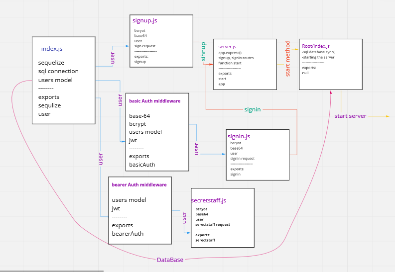

# bearer-auth

In this repo we make a basic signIn and SighUp backend server using Bearer Auth, we generate a token and send it to the server to check the validation of the user.

## links

* [PR Link]()

* [action]()

* [heroku]()

### UML diagram 

